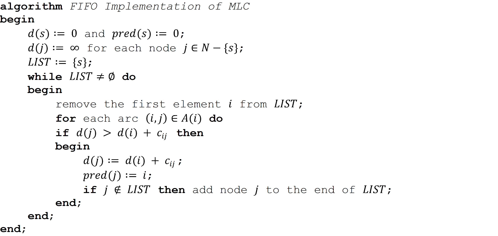
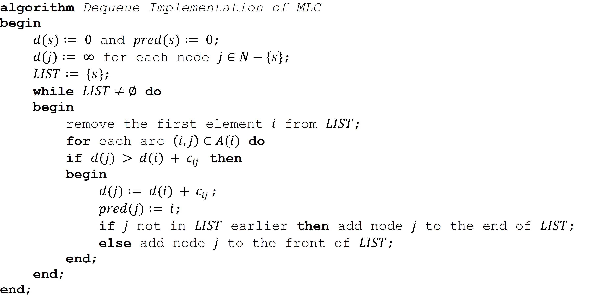
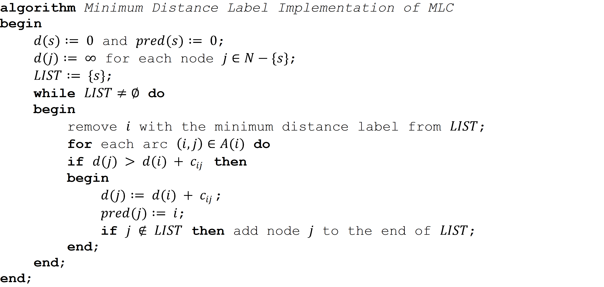
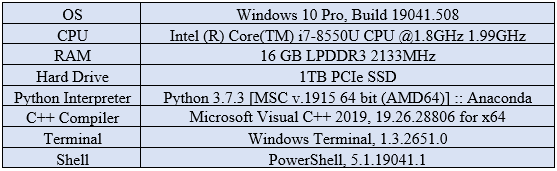

# Boost Shortest Path Algorithm Implementations using Proper Data Structures

This sub-project will concentrate on the modified label correcting (MLC) algorithm and its three special implementations, and demonstrate how to boost their
performances in terms of running time by reducing some key operations from linear time to logarithmic or constant time through introducing the following data structures.

1. Use an indicator array rather than the built-in x in s operation to check the presence of an element x in a list/container s for all implementations;
2. Adopt the built-in deque to replace list and its pop(0) and insert(0, x) operations in the deque implementation;
3. Replace the built-in deque with a simplified array-based deque for the deque implementation;
4. Introduce binary heap (heapq) in the Minimum Distance Label implementation.
   
## The MLC Algorithm and Its Three Special Implementations
The MLC algorithm for the single source shortest path (SSSP) problem is given in Figure 1. LIST is the list of all arcs that might violate their optimality conditions. 

**Figure 1** Modified Label Correcting Algorithm (*Reproduced from [1]*)

The MLC does not specify methods on removing an existing element from LIST and adding a new element to it. In fact, how to maintain and update this list leads to different implementations of the MLC. Three efficient implementations are listed as below.

1. Maintain LIST as a First-In-First-Out (FIFO) queue. Remove the element from front and add the new element to the rear.
2. Maintain LIST as a double-ended queue (Dequeue). Remove or add an element from either front or rear.
3. Maintain LIST as any data container (e.g., list in Python). Remove the element with minimum distance label (i.e., arg⁡min⁡{d(i)|∀i∈LIST}) and add the new element to the rear.

The first two are well-known as the FIFO (or O(mn)) implementation and the Dequeue (or deque) implementation respectively while the last one is essentially the same as Dijkstra's Algorithm. Their psudo codes are shown in Figures 2, 3, and 4.

**Figure 2** FIFO Implementation of MLC (*Reproduced from [2]*)

**Figure 3** Deque Implementation of MLC (*Reproduced from [2]*)

**Figure 4** MDL Implementation of MLC (*Reproduced from [2]*)

## Benchmarks

Table 1 lists all the implementations in this study. For each Python implementation, its equivalent C++ implementation is introduced for benchmarking. vector, deque, and priority_queue from STL (standard Template Library) are C++ counterparts for Python list, deque, and heaq respectively. 

**Table 1** CPU Time Comparisons over Different Implementations

    

A moderate real-world network with 933 nodes and 2950 arcs, the Chicago sketch from the latest release of stalite-dtalite ([3]), is adopted as the underlying test network with slight format modifications. Table 1 summaries the CPU times under different implementations.

**Table 2** Test Platform

We time each implementation for five runs and calculate the average excluding the highest and lowest. One additional run is conducted for Python as the first run of each implementation involves compiling source code to byte code. To get rid of the potential impact from IDE (Integrated Development Environment), the applications are all launched directly using PowerShell from the terminal (while IDEs remain closed). All the information regarding the test platform and tools can be found in Table 2. 

## References
1. R. K. Ahuja, T. L. Magnanti, and J. B. Orlin, Network Flows: Theory, Algorithms, and Applications. Prentice Hall, 1993.
2. Z. Cui, C. Li, and X. Zhou, “Introduction to Label Correcting Algorithm,” 2020.
3. X. Zhou, “STALite/DTALite/NeXTA Software,” 2020. [Online]. Available: https://github.com/xzhou99/stalite-dtalite_software_release.