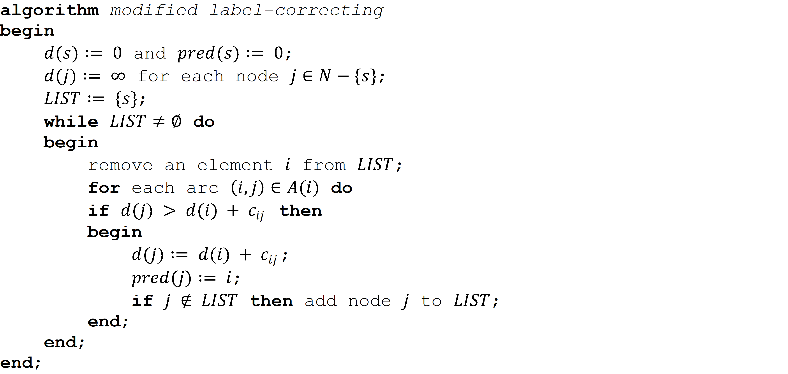
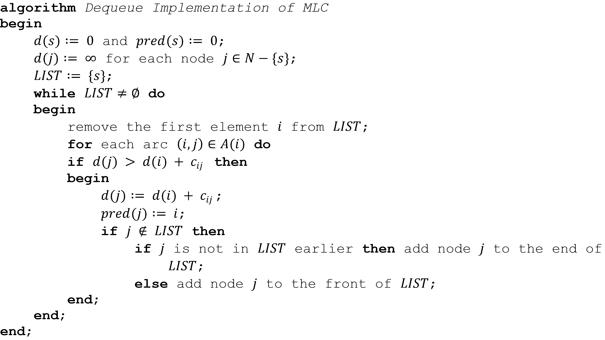
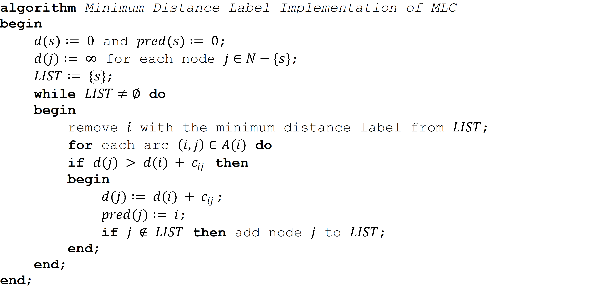

# Boost Shortest Path Algorithm Implementations using Proper Data Structures

This project will concentrate on the modified label correcting (MLC) algorithm and its three special implementations, and demonstrate how to boost their
performances in terms of running time by reducing some key operations from linear time to logarithmic or constant time through the following data structures.

1. Use an indicator array rather than the built-in x in s operation to check the presence of an element x in a list/container s for all implementations;
2. Adopt the built-in deque to replace list as well as its pop(0) and insert(0, x) operations in the deque implementation;
3. Replace the built-in deque with a simplified array-based deque for the deque implementation;
4. Introduce binary heap (heapq) in the Minimum Distance Label implementation.

Three major goals are made to this project.

1.	**Efficiency**. The examples are implemented towards the running speed required by enterprise-level applications.
2.	**Minimum dependency with no compromise on performance**. Only facilities from the Python Standard Library are utilized with no any other third-party libraries. Portability is achieved simultaneously as a result of the minimum dependency.
3.	**Readability**. Implementations are made as close as the pseudo codes.

## The MLC Algorithm and Its Three Special Implementations
The MLC algorithm for the single source shortest path problem (SSSP) is given in Figure 1. LIST is the list of all arcs that might violate their optimality conditions.

**Figure 1** Modified Label Correcting Algorithm (*Reproduced from [1]*)

The MLC does not specify how to remove an existing element from LIST and add a new element to it. In fact, how to maintain and update this list leads to different implementations of the MLC. Three efficient implementations are listed as below.

1. Maintain LIST as a First-In-First-Out (FIFO) queue. Remove an element from front and add a new element to rear.
2. Maintain LIST as a double-ended queue (Dequeue). Remove an element from front and add an element to either front or rear.
3. Maintain LIST as any data container (e.g., list in Python). Remove the element with minimum distance label (i.e., arg⁡min⁡{d(i)|∀i∈LIST}).

The first two are well-known as the FIFO (or O(mn)) implementation and the Dequeue (or deque) implementation respectively while the last one is essentially the same as Dijkstra's Algorithm. Their pseudo codes are shown in Figures 2, 3, and 4.

**Figure 2** FIFO Implementation of MLC (*Reproduced from [2]*)

**Figure 3** Deque Implementation of MLC (*Reproduced from [2]*)

**Figure 4** MDL Implementation of MLC

## Benchmarks

Table 1 lists all the implementations in this study. For each Python implementation, its equivalent C++ implementation is introduced for benchmarking. vector, deque, and priority_queue from C++ STL (Standard Template Library) are corresponding to Python list, deque, and heapq.

**Table 1** CPU Time Comparisons over Different Implementations

A moderate real-world network with 933 nodes and 2950 arcs, the Chicago Sketch Network] ([3]), is adopted as the underlying test network with slight format modifications.

**Table 2** Test Platform

We time each implementation for five runs and calculate the average excluding the highest and lowest. One additional run is conducted for Python as the first run of each implementation involves compiling source code to byte code. Furthermore, the applications are all launched directly using PowerShell from the terminal (while IDEs remain closed) to get rid of the potential impact from IDE (Integrated Development Environment). Table 1 summaries the CPU times under different implementations. All the information regarding the test platform and tools can be found in Table 2.

### More Discussion on the Deque Implementations in C++

Table 1 reveals one interesting observation from the deque implementations in C++. Adopting deque from STL actually leads to a slightly worse performance compared to the base implementation using vector (0.589s vs. 0.488s).

The aforementioned worse performance using deque to maintain LIST is directly related to the run-time size growth during the label correcting process. The number of its size update is way more than that of the presence check, which is approximately 1.74 million times for the test network. Therefore, we test the performances of the two deque implementation of the MLC in C++ using different compliers on different operating systems (OS) and list in Table 3 rather than tracing it at run time (which would be tedious and unnecessary for such small performance difference). Note that compiler optimization is not enabled for those runs.

**Table 3** CPU Time Comparisons over Different Compliers and OS for the Deque Implementations of MLC in C++

As shown in Table 3, the performance difference between the two implementations is related to the OS as well. On Linux and macOS, the performances are consistent with the Python counterparts. Although the clang has the most aggressive block size for deque, the deque implementation with deque is still slightly worse than that with vector on Windows. Interestingly, the executable compiled by clang runs slightly faster on WSL2 than on its host OS (i.e., Windows 10) for the deque implementation with deque.

## Furthermore

Even though all the algorithms are implemented towards high efficiency, there is still space for further improvement. For example, use intrusive container to store outgoing link of each node for all implementations, add check on scanned nodes in the heap-Dijkstra implementation, and replace binary heap with Fibonacci heap, etc.

## References
1. R. K. Ahuja, T. L. Magnanti, and J. B. Orlin, Network Flows: Theory, Algorithms, and Applications. Prentice Hall, 1993.
2. Z. Cui, C. Li, and X. Zhou, “Introduction to Label Correcting Algorithms,” 2020.
3. X. Zhou, “STALite/DTALite/NeXTA Software,” 2020. [Online]. Available: https://github.com/xzhou99/stalite-dtalite_software_release.